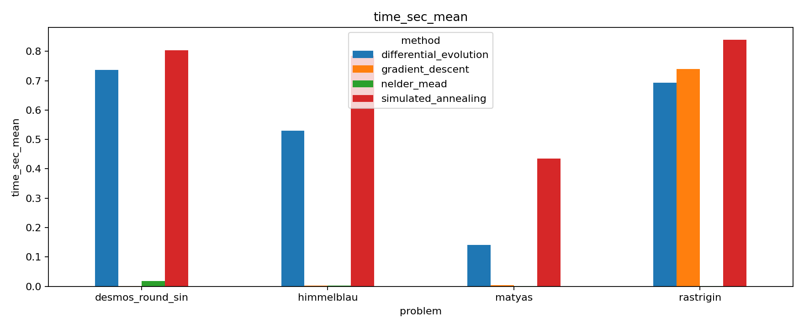
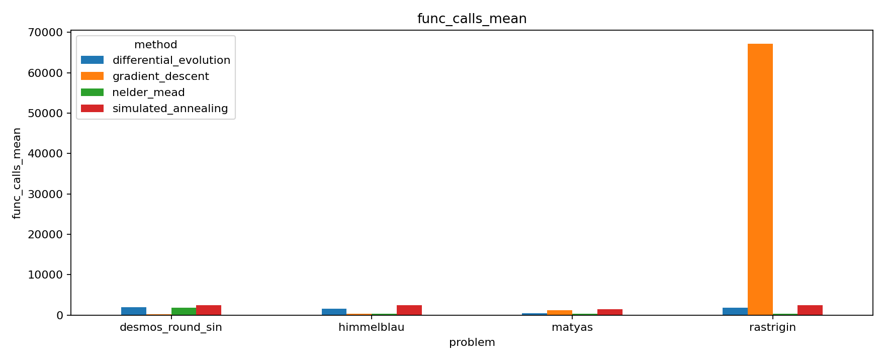
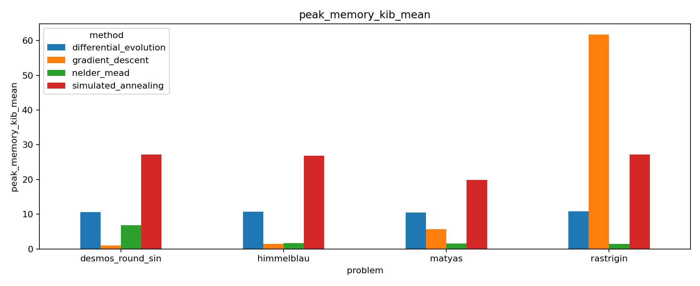

# Лабораторная работа 2

## 1. Цель и постановка задачи

В работе исследуется оптимизация функций, в том числе негладких, на конструктивных числах. Требовалось:

- реализовать стохастические методы оптимизации и сравнить их с методами из предыдущей лабораторной;
- провести сравнение по скорости, числу вызовов функции и памяти;
- дать теоретическое объяснение, почему одни методы выигрывают у других на разных типах функций.

Основной эксперимент реализован в [Research.ipynb](./Research.ipynb), код методов — в [src](./src).

## 2. Реализованные методы и тестовые функции

### Методы

- [Градиентный спуск](./src/Optimization.py)
- [Метод Нелдера - Мида](./src/Optimization.py)
- [Алгоритм имитации отжига](./src/StochasticOptimization.py)
- [Дифференциальная эволюция](./src/StochasticOptimization.py)

### Тестовые функции

- Функция Матьяса
- Функция Химмельблау
- Функция Растригина
- Функция из условия в desmos

См. [src/TestFunctions.py](./src/TestFunctions.py).

## 3. Конфигурация экспериментов

Сценарий запусков: [src/ToolsResearch.py](./src/ToolsResearch.py).

- Число прогонов на пару (метод, задача): `12`
- `base_seed = 42`
- Параметры:
- `gradient_descent`: `learning_rate=0.1`, `max_iter=2000`, `tol=1e-8`
- `nelder_mead`: `step=0.8`, `max_iter=2000`, `tol=1e-8`
- `simulated_annealing`: `max_iter=3000`, `temp_start=2.0`, `temp_end=1e-4`, `cooling_rate=0.996`, `step_scale=0.15`
- `differential_evolution`: `pop_size=35`, `max_iter=600`, `mutation=0.8`, `crossover=0.9`, `tol=1e-10`

## 4. Метрики

### 4.1 Вычислительные метрики

- `time_sec_mean` - среднее время выполнения;
- `func_calls_mean` - среднее число вызовов целевой функции;
- `peak_memory_kib_mean` - средний пиковый расход памяти;
- `converged_rate` - доля запусков, завершившихся по внутреннему критерию метода.

### 4.2 Метрики качества решения

Для задач с известным эталоном считалось `MAE`, `MSE` и `RMSE`

Для `desmos_round_sin` эталонное значение не задано, поэтому quality-метрики для нее не считаются.

## 5. Результаты экспериментов

### 5.1 Сводная таблица

Полные данные:

- [summary.csv](./report_assets/summary.csv)
- [summary_with_quality.csv](./report_assets/summary_with_quality.csv)
- [quality_metrics.csv](./report_assets/quality_metrics.csv)
- [detailed.csv](./report_assets/detailed.csv)

### 5.2 Лучший метод по задаче

Отбор делался как в ноутбуке: сортировка по `success_rate` (убыв.), затем `mae_mean` (возр.), затем `time_sec_mean` (возр.) среди строк с `success_support > 0`.

| Задача | Лучший метод | success_rate | MAE | Время, сек | Вызовы функции | Память, KiB |
|---|---|---:|---:|---:|---:|---:|
| `himmelblau` | `gradient_descent` | 1.0000 | 3.05e-19 | 0.001903 | 372.0 | 1.4248 |
| `matyas` | `gradient_descent` | 1.0000 | 4.30e-17 | 0.003647 | 1157.0 | 5.6722 |
| `rastrigin` | `differential_evolution` | 0.8333 | 1.07e-01 | 0.692589 | 1860.8 | 10.8301 |

`desmos_round_sin` не попадает в этот рейтинг, потому что для нее нет `ref_value`, следовательно `success_support = 0`.

Источник: [best_by_problem.csv](./report_assets/best_by_problem.csv)

## 6. Графики

### Время выполнения

### Число вызовов функции

### Пиковая память

## 7. Интерпретация результатов

### 7.1 Про градиентный спуск

В текущей версии эксперимента для градиентного спуска задан фиксированный `learning_rate=0.1`. Это существенно влияет на поведение:

- на `himmelblau` и `matyas` метод остается очень точным (`MAE` порядка `1e-19 ... 1e-17`), но требует заметно больше итераций/вызовов, чем в конфигурации с автоподбором шага
- на `rastrigin` метод уходит в неуспех, упирается в лимит итераций
- на `desmos_round_sin` также `converged_rate = 0`

Теоретически это ожидаемо: фиксированный шаг, выбранный в среднем, плохо переносится на сложные мультимодальные и негладкие ландшафты.

### 7.2 Почему метод Нелдера - Мида стабилен по `converged_rate`

`nelder_mead` не использует градиент и опирается на геометрию симплекса, поэтому устойчив к негладкости и шумной форме поверхности. В текущих данных у него `converged_rate = 1` на всех задачах.

Ограничение: на `rastrigin` при формальной сходимости качество решения слабое (`MAE = 17.9`), т.е. метод стабильно сходится, но в неудачную область.

### 7.3 Почему алгоритм имитации отжига выигрывает на `rastrigin`

`rastrigin` - мультимодальная функция с большим числом локальных минимумов. Популяционный глобальный поиск в `differential_evolution` лучше избегает ловушек локальных минимумов, поэтому в текущем эксперименте он лучший по quality-метрикам на этой задаче (`MAE - 0.107`, `success_rate = 0.833`).

Цена за это - высокая вычислительная стоимость (время и число вызовов функции выше, чем у локальных методов на гладких задачах).

### 7.4 Почему дифференциальная эволюция` уступает

Метод моделирует стохастический поиск с постепенным охлаждением. При выбранных параметрах он тратит много итераций на исследование пространства и в среднем уступает по качеству и скорости:

- низкий `success_rate` на `himmelblau` и `rastrigin`
- очень высокая вычислительная стоимость (`1490–2472` вызовов функции и соответствующее время)

То есть метод потенциально универсален, но в данной настройке не откалиброван под рассматриваемые функции.

## 8. Общие выводы

1. На гладких задачах локальные методы остаются очень сильными по точности.
2. На мультимодальной `rastrigin` лучше проявляет себя глобальный стохастический поиск.
3. Формальная сходимость не гарантирует хорошего качества минимума, поэтому ее нужно анализировать вместе с `MAE/MSE/RMSE`.
4. Универсально лучшего метода нет. Выбор определяется свойствами функции.

