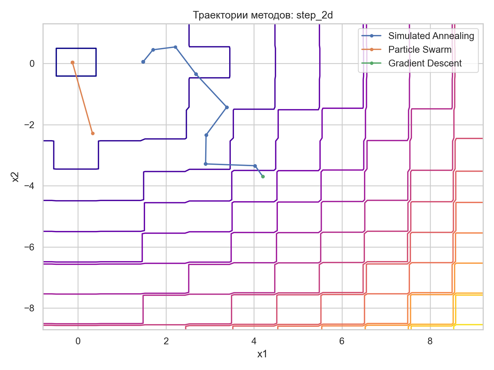
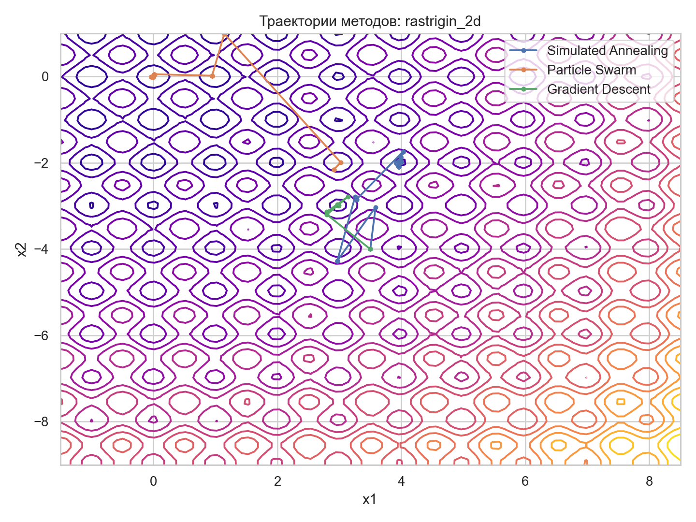
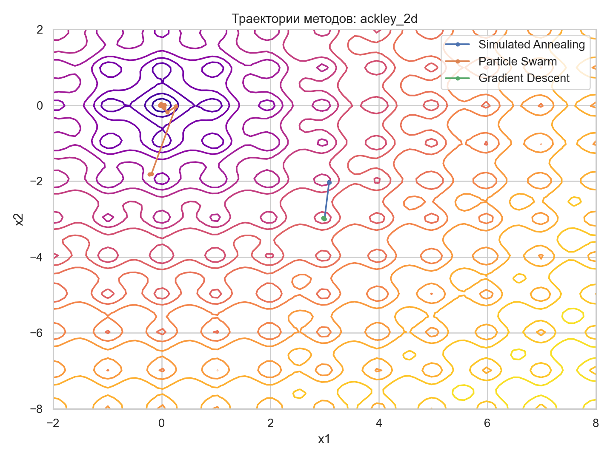
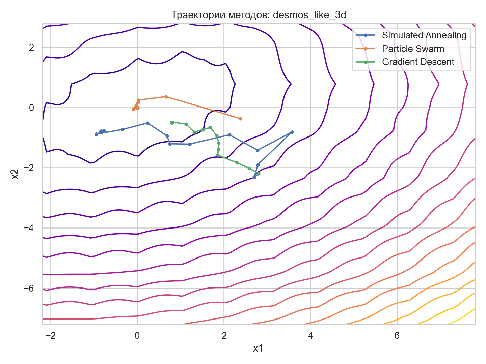

# Отчет по лабораторной работе №2

## Постановка

Во второй лабораторной реализованы два стохастических метода оптимизации поверх конструктивного числа:

1. `Simulated Annealing`
2. `Particle Swarm Optimization`

Для сравнения были также использованы методы из первой лабораторной:

1. `Nelder-Mead`
2. `Gradient Descent`
3. `Newton Method`

## Реализованные функции

Для исследования использованы четыре функции:

1. `Step2D` - разрывная ступенчатая функция.
2. `Rastrigin2D` - мультимодальная тестовая функция.
3. `Ackley2D` - мультимодальная тестовая функция.
4. `DesmosLike3D` - негладкая 3D-функция с гребнями и рябью.

Прямой доступ к выражению по ссылке Desmos из среды выполнения не удалось получить, поэтому в работе использована отдельная негладкая 3D-функция того же исследовательского класса: она сочетает квадратическую чашу, модули и осциллирующие члены.

## Почему нужны стохастические методы

Детерминированные методы из первой лабораторной хорошо работают на гладких выпуклых функциях, но на разрывных и сильно мультимодальных функциях они сталкиваются с двумя типичными проблемами:

1. Градиент может отсутствовать или быть плохо информативным.
2. Метод может застревать в локальном минимуме.

Стохастические методы выигрывают тем, что:

1. Не требуют точного градиента.
2. Лучше исследуют пространство поиска.
3. Устойчивее к шуму, разрывам и множеству локальных минимумов.

Но они уступают тем, что:

1. Требуют больше вызовов функции.
2. Хранят больше состояния.
3. Имеют более медленную и менее предсказуемую сходимость.

## Что реализовано в коде

Структура проекта:

1. `src/constructive_number.py` - конструктивное число.
2. `src/objectives.py` - тестовые функции.
3. `src/stochastic_optimizers.py` - стохастические методы.
4. `src/deterministic_optimizers.py` - базовые методы из первой лабораторной для сравнения.
5. `src/experiments.py` - запуск экспериментов, построение таблиц и графиков.

## План эксперимента

1. Для каждой функции берутся три значения `epsilon`: `1e-2`, `1e-4`, `1e-6`.
2. На каждой постановке запускаются два стохастических и три детерминированных метода.
3. Для каждого метода сохраняются:
   значение функции,
   расстояние до известного минимума,
   число вызовов функции и производных,
   условная оценка памяти,
   динамика сходимости.
4. Результаты сохраняются в `img/summary.csv`.

## Результаты экспериментов

Полная таблица находится в `img/summary.csv`. Основные наблюдения следующие.

### Step2D

1. `Particle Swarm Optimization` нашел глобальный минимум `0.0` для всех трех `epsilon`.
2. `Simulated Annealing` стабильно улучшал значение функции до `1.0`, но не доходил до нуля.
3. Градиентный спуск и метод Ньютона почти не двигались, потому что на ступенчатой функции производная не несет полезной информации.

Для `epsilon = 1e-4`:

| Метод | Значение | Вызовы | Память |
| --- | ---: | ---: | ---: |
| Simulated Annealing | 1.0 | 251 | 8 |
| Particle Swarm | 0.0 | 3258 | 144 |
| Nelder-Mead | 25.0 | 136 | 6 |
| Gradient Descent | 32.0 | 6 | 6 |
| Newton Method | 32.0 | 6 | 6 |

### Rastrigin2D

1. `Particle Swarm Optimization` снова нашел глобальный минимум `0.0`.
2. `Simulated Annealing` улучшил стартовую точку, но остановился в локальном минимуме.
3. Детерминированные методы заметно проиграли по качеству найденного решения.

Для `epsilon = 1e-4`:

| Метод | Значение | Расстояние до минимума |
| --- | ---: | ---: |
| Simulated Annealing | 19.899341 | 4.448809 |
| Particle Swarm | 0.0 | 0.0 |
| Nelder-Mead | 31.838488 | 5.628264 |
| Gradient Descent | 17.909202 | 4.221223 |
| Newton Method | 48.231685 | 5.311687 |

### Ackley2D

1. Лучший результат снова показал `Particle Swarm Optimization`.
2. `Simulated Annealing` сработал лучше детерминированных методов по качеству, но не достиг глобального минимума.
3. `Nelder-Mead`, `Gradient Descent` и `Newton Method` сходились к одной и той же неудачной области.

### DesmosLike3D

1. На негладкой 3D-функции лучший результат также дал `Particle Swarm Optimization`.
2. `Simulated Annealing` оказался самым экономным по числу вызовов функции.
3. Детерминированные методы хуже переносят негладкость и сложный рельеф поверхности.

## Основные выводы

1. Для негладких и мультимодальных функций стохастические методы оказались полезнее методов из первой лабораторной.
2. Лучший по качеству решения метод в этой работе - `Particle Swarm Optimization`, но он же требует больше всего памяти и вызовов функции.
3. `Simulated Annealing` дешевле по памяти и количеству хранимого состояния, но уступает `Particle Swarm Optimization` по качеству финального решения.
4. Методы из первой лабораторной остаются быстрыми на гладких задачах, но на ступенчатых и мультимодальных функциях часто либо застревают, либо вообще не получают информативного направления движения.
5. Использование конструктивного числа не ломает стохастические методы, потому что решение принимается по центру интервала, однако при большом числе итераций и преобразований неопределенность все равно накапливается.

## Артефакты

После запуска `python3 -m src.experiments` будут созданы:

1. `img/summary.csv`
2. `img/summary.json`
3. Графики траекторий `trajectory_*.png`
4. Графики сходимости `convergence_*.png`

Ниже приведены основные графики траекторий.

